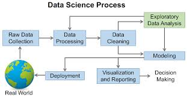
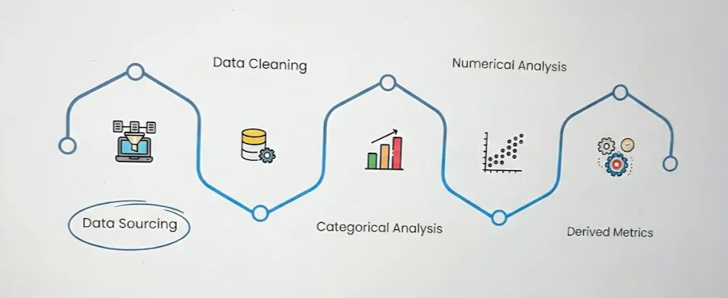

# EDA

**EDA (Exploratory Data Analysis)** is the process of **analyzing and summarizing data to understand its main characteristics**, patterns, and relationships **before** applying any statistical models or machine-learning algorithms.

## Visualization

Visualization is the presentation of the data in the graphical or visual form to understand the data more clearly. visualization is easy to understand the data.

## Types of data visualization

**Steps involved in EDA**

1. **Data Sourcing**
- Data sourcing is the process of gathering data from multiple sources as external or internal data collection.

1. **Data cleaning**
- **Data cleaning** is the process of **identifying and fixing errors, inconsistencies, and missing values in data** to make it accurate, complete, and ready for analysis.

